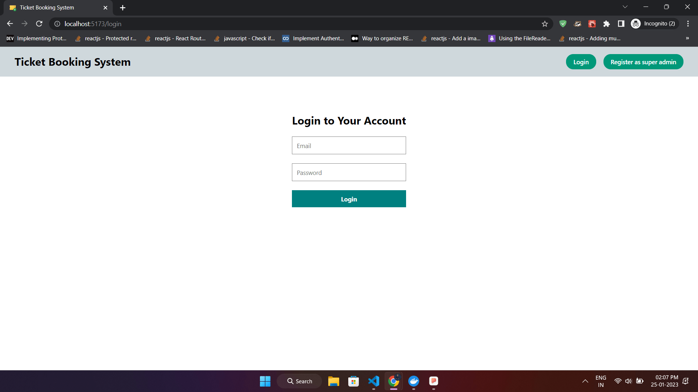
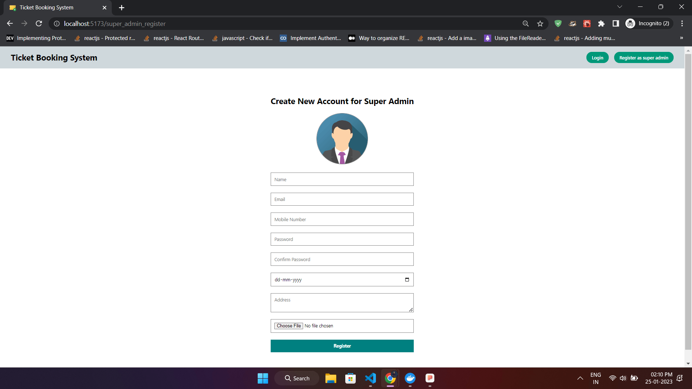
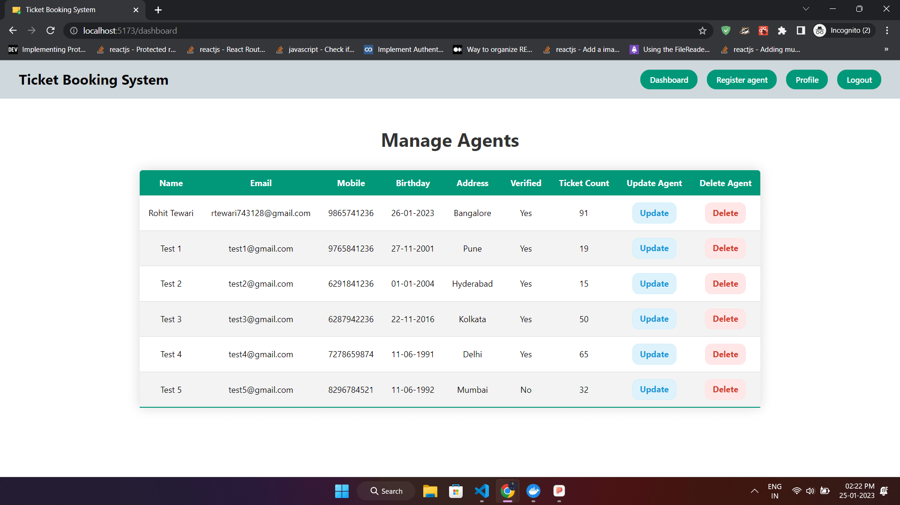
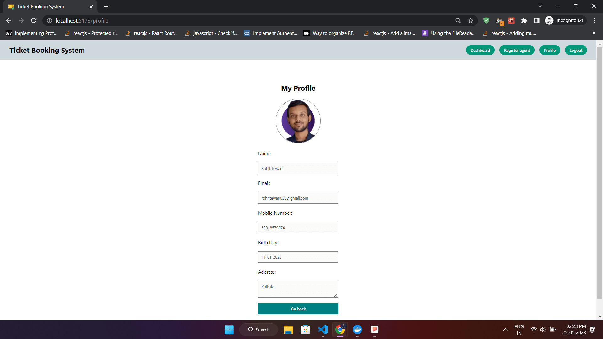
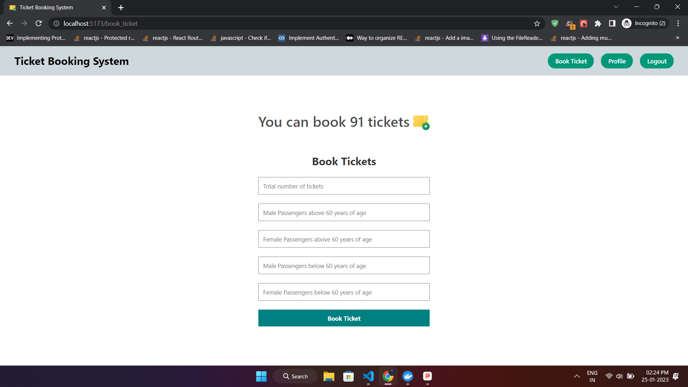
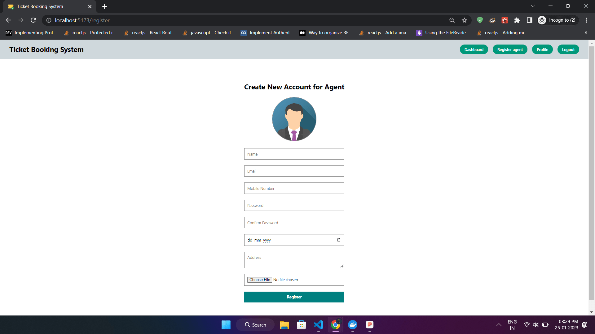

<div align="center">

<!-- Title: -->
  <a href="https://spritle.rohittewari.live" target="_blank">
    
  </a>

<!-- Short description: -->
<h2>Train Ticket Booking System</h2>

<!-- Labels: -->
  <div>
  <a href="https://spritle.rohittewari.live" target="_blank">
    
  </a>
  
  
  </div>

</div>

<br/>

## 🚀 Screenshots

This application is deployed on DigitalOcean. Please check it out :smile: [here](https://spritle.rohittewari.live).

### Login Page


### Super Admin Registration Page


### Super Admin Dashboard Page


### Profile Page


### Ticket Booking Page


### Agent Registration Page


## 📖 Prerequisites

In order to run the project you need `node>=16`, `npm>=8` and `MySQL>=8.0` installed on your machine.

## 🚩 Getting Started

### 1. Open MySQL Command Line Client and run the below `SQL commands` defined in `/server/src/db/init.sql` file:

```sql
-- Create a database named spritle
CREATE DATABASE IF NOT EXISTS spritle;

-- Use the database to make changes to it
USE spritle;

-- Drop table 'user' if exists
DROP TABLE IF EXISTS user;

-- Create a table named 'user' inside 'spritle' database
CREATE TABLE user (
  name VARCHAR(30) NOT NULL,
  email VARCHAR(45) NOT NULL,
  mobile VARCHAR(20) NOT NULL UNIQUE,
  password VARCHAR(100) NOT NULL,
  birthday DATE NOT NULL,
  address VARCHAR(200) NOT NULL,
  profilePic VARCHAR(200) DEFAULT "https://res.cloudinary.com/devcvus7v/image/upload/v1674454463/ticket_booking_system/avatar.png",
  ticket_count INT NOT NULL DEFAULT 0,
  is_super_admin BOOLEAN DEFAULT 0,
  is_verified BOOLEAN DEFAULT 0,
  verification_token VARCHAR(50),
  PRIMARY KEY (email)
);
```

### 2. Now, open a terminal session in project `root` directory and install dependencies:

```bash
npm install # Server dependencies
cd client
npm install # Client dependencies
```

### 3. Rename `.env.example` into `.env` and put all the creadentials:
```bash
# In the root directory put your creadentials:

# Server configaration
PORT=5000

# Token configaration
ACCESS_TOKEN_PRIVATE_KEY="YOUR_JWT_SECRET"
ACCESS_TOKEN_EXPIRE=60 # In mins

# MySQL configaration
DB_HOST=localhost
DB_USER=<MYSQL_DATABASE_USER_NAME>
DB_NAME=spritle
DB_PORT=3306
DB_PASSWORD=<MYSQL_DATABASE_PASSWORD>
DB_CONNECTION_LIMIT=10

# SMTP configaration (Sendinblue Email Service)
SMTP_HOST=<YOUR_SMTP_SERVER_HOST_NAME>
SMTP_PORT=587
SMTP_USER=<YOUR_SMTP_SERVER_USER_NAME>
SMTP_PASSWORD=<YOUR_SMTP_SERVER_PASSWORD>
EMAIL_FROM=no-reply@TicketBookingSystem.com # The email address of the sender

# Now go to client folder and put your cloudinary creadentials:
VITE_CLOUDINARY_CLOUD_NAME=<YOUR_CLOUDINARY_CLOUD_NAME>
VITE_CLOUDINARY_UPLOAD_PRESET=<YOUR_CLOUDINARY_UPLOAD_PRESET>
```


### 4. Run project:
In the project `root` directory, open two terminal sessions and run both commands separately:

```bash
npm run client
npm run server
```

### 5. Now, open your browser and go to `http://localhost:5173`

## 👤 Developer

[Rohit Tewari](https://github.com/rtewari056)

## 📬 Contact

If you want to contact me, you can reach me through below handles.

<a href="https://linkedin.com/in/rtewari056" target="_blank"></a>
<a href="mailto:rtewari056@gmail.com"></a>
<a href="https://twitter.com/rtewari056" target="_blank"></a>